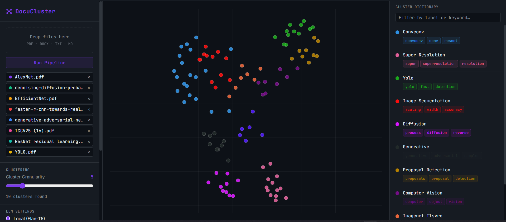

# DocuCluster

A fully local semantic document clustering and exploration tool.
Upload your PDFs, papers, or notes — DocuCluster automatically
discovers topics, groups related passages, and lets you explore
everything on an interactive map. No cloud, no API keys,
everything runs on your machine.

Built as a personal learning project while studying text
clustering and topic modeling techniques from
"Hands-On Large Language Models" by Jay Alammar and
Maarten Grootendorst.



## What it does

Upload documents → chunks are embedded → UMAP reduces
dimensions → HDBSCAN finds clusters → BERTopic labels them →
interactive map appears.

- **Scatter view** — UMAP 2D visualization, each dot is a chunk,
  color = topic
- **Graph view** — D3 force-directed graph showing semantic
  connections between chunks
- **Cluster Dictionary** — searchable panel showing all topics
  with keywords
- **Hybrid Search** — BM25 + semantic reranking, results light
  up on the map

## Pipeline

## Tech stack

**Backend**
- FastAPI + WebSockets (real-time pipeline progress)
- sentence-transformers (thenlper/gte-small) for embeddings
- UMAP for dimensionality reduction
- HDBSCAN for clustering
- BERTopic + c-TF-IDF for topic modeling
- Flan-T5 (local) or Ollama for topic labeling
- BM25 + cosine similarity for hybrid search

**Frontend**
- React + TypeScript
- Plotly.js for UMAP scatter plot
- D3.js force simulation for graph view
- Zustand for state management
- Vite

## Setup

### Requirements
- Python 3.10+
- Node.js 18+
- CUDA GPU recommended (runs on CPU but slower)
- 8GB+ RAM recommended

### Backend

```bash
cd backend
pip install -r requirements.txt
uvicorn main:app --reload --host 0.0.0.0 --port 8000
```

### Frontend

```bash
cd frontend
npm install
npm run dev
```

Open http://localhost:5173

### Optional: Ollama for better labels

Install [Ollama](https://ollama.com), pull a model:
```bash
ollama pull llama3.2
```
Then select Ollama in the UI and enter your model name.

## Usage

1. Drop PDF, DOCX, TXT, or MD files into the upload area
2. Adjust Cluster Granularity (lower = fewer, larger clusters)
3. Click **Run Pipeline** and watch it process in real time
4. Explore the map — click clusters to see their chunks
5. Use the search bar for semantic search across all documents
6. Toggle between Scatter and Graph view

## Supported formats

PDF · DOCX · TXT · Markdown

## License

MIT
